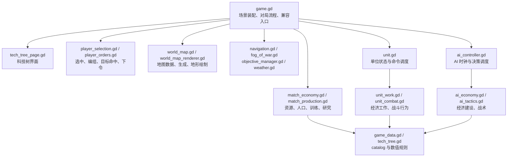

# 代码架构与拆分顺序

主场景 `scenes/main.tscn` 使用 `scripts/game.gd` 装配一局游戏。现阶段保留它的公开方法与字段：单位、建筑、AI 和现有测试仍通过 `game` 访问对局。这些方法中已拆出的部分只负责转发；新逻辑按职责放在独立脚本中。

## 当前边界

- `game.gd` 仍持有玩家、实体、选中对象及界面控件；旧调用方可以继续使用 `start_game`、`train_unit`、`credit_resource` 等方法。
- `player_selection.gd` 处理框选、双击同类、编组与地图目标命中；`player_orders.gd` 处理右键命令、攻击移动和编队下令。输入事件分发仍在 `game.gd`。
- `match_economy.gd` 处理资源、市场和人口规则；`match_production.gd` 处理训练、研究及取消队列。它们目前通过 `game` 读取对局状态，尚未拥有独立状态。
- `unit.gd` 保留命令状态与逐帧调度，工作和战斗细节分别交给 `unit_work.gd`、`unit_combat.gd`。
- `ai_controller.gd` 保留思考周期与原有状态字段，经济和战术决策分别交给 `ai_economy.gd`、`ai_tactics.gd`。
- `world_map.gd` 保留地图生成和地形查询；绘制交给 `world_map_renderer.gd`。

## 后续顺序

1. 将 `game.gd` 中的对局状态与实体注册迁到单独的 session，继续保留旧字段和方法的兼容入口。
2. 将输入事件分发和快捷键移出主脚本，逐步让玩家输入和 AI 调用同一套命令服务。
3. 把 HUD、设置和战报界面逐步移出 `game.gd`，再收窄各模块对 `game` 的直接字段访问。
4. 每次迁移后运行相关固定种子测试，并比较 `tests/performance_400.gd` 的模拟耗时。

这一顺序避免同时改变规则、调用接口和状态所有权；删除兼容入口应单独进行，并先更新直接访问它们的测试。
