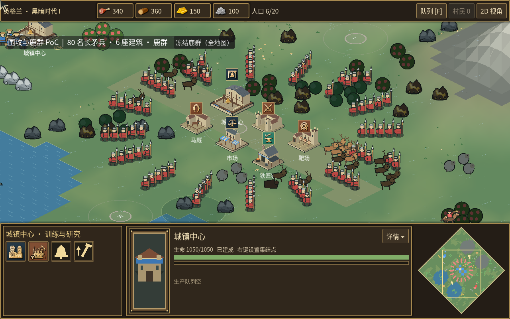

# 低利用率与 6 建筑围攻分析

2026-09-29，Apple M2、8 个 CPU 核心，项目自带 Godot 4.7.2 Compatibility/OpenGL 运行时。

## 结论与证据

主要瓶颈集中在主线程：导航网格准备、图形提交，以及 macOS 异步限帧的额外等待。整机 CPU 百分比会平均所有核心；8 核机器上一条满负载线程只对应约 12.5% 整机 CPU。最初实际围攻进程测得约 83.5% 单核口径 CPU，并采样了主线程调用栈。GPU 低利用率与 CPU 提交/等待瓶颈并不矛盾。

最初 6 建筑、80 人、鹿群的窗口诊断（1280×800，旧 PoC 的等比例 camera zoom 0.95）360 帧均值：

| 帧段 | 均值 |
| --- | ---: |
| 场景阶段：模拟、脚本重绘及提交前处理 | 32.26 ms |
| 渲染阶段：CPU 提交、驱动及呈现 | 12.16 ms |
| 帧间阶段：事件、物理及等待 | 9.25 ms |
| 整帧 | 53.67 ms |

分段使用 SceneTree `process_frame` 和 RenderingServer `frame_pre_draw` / `frame_post_draw` 的真实时间戳。帧间阶段不能全部直接称为睡眠；独立等待 PoC 进一步证明其中约 9 ms 是错误限帧。当前后端报告的 GPU 测时为 0，不视作 GPU 真实耗时为零。没有使用 headless 帧率代表窗口 FPS。

单独给脚本回调加计时的诊断显示，单位 `_process` 约 19.6–23.2 ms/帧；单位 `_draw` 约 2.3–2.4 ms/帧；6 座建筑及原地图建筑的 `_draw` 约 1 ms/帧。导航网格的准备远比原生 A* 搜索昂贵。嵌套导航计时不能和父级单位计时相加。

## 已做的三个 PoC

1. [异步限帧预算](frame-budget.md)：固定 25 ms 主线程工作，整帧 34.70 → 25.72 ms；额外等待 9.08 → 0.11 ms。提交 `3afecac`，已推送。
2. [静态网格准备](static-grid.md)：6 建筑、150 资源，30 次冷建粗网格 319.15 → 45.97 ms。187,794 个格子逐一符合独立碰撞判定。提交 `5de8b2a`，已推送。
3. [小多边形提交](polygon-batching.md)：同画面的 3153 → 2851 个 draw call，视口 CPU 提交 8.22 → 7.50 ms；4,096,000 个通道比较，最大差异 1/255。提交 `0a93a0c`，已推送。当前会话的 `git add` 曾因 `.git` 只读而被拒绝，随后共享工作区的另一提交流程完成了提交；`origin/main` reflog 确认为 `update by push`。

这些结果分别隔离等待、导航和渲染，不意味着已经稳定 60 FPS。仍有动态拥堵恢复的长帧，以及不可合批的描边、圆形等图形提交成本。

## 实际可玩的 PoC

```sh
make run RUN_ARGS='--script res://tools/battle_deer_poc.gd --windowed --resolution 1280x800'
```

中央 6 座建筑：城镇中心、兵营、靶场、马厩、市场、铁匠铺；80 名长矛兵，旁边增加 8 只鹿。保留生成地图原有的资源、动物、起始单位和建筑，因此全地图实体总量多于这些新增实体。默认所有进攻者集中攻击城镇中心，可用画面中的按钮切换为分散攻击 6 座建筑，也可冻结/恢复全地图鹿群。

PoC 禁用 AI 与迷雾、延长双方生命值，以持续观察实际围攻，保留真实帧 delta、导航、碰撞、战斗和渲染。摄像机已恢复标准 2.5D 的 0.85×0.425 缩放，使 6 座建筑都能看到。不要把关闭 AI/迷雾的场景当成完整游戏性能承诺。



单建筑对照可设置 `RTS_POC_BUILDINGS=1`；`RTS_POC_FOCUS=0` 为分散攻击。`RTS_POC_FREEZE=1` 冻结模拟但仍渲染，`RTS_POC_HIDE_MAP=1` 隐藏地图，`RTS_POC_HIDE_ENTITIES=1` 隐藏实体，均在暖机后生效，用于隔离开销。正式帧率对照不要设置这些诊断选项。

## 整场 FPS 的验证边界

已有 6 建筑分散攻击观测为修复前约 55–56 ms/帧、修复后约 29 ms/帧。但实验中途环境权限切换，一次单建筑运行出现 25 秒外部停顿；重新启动的窗口程序在 macOS XPC 初始化超时，无法完成干净的等时长复测。原始观测保存为 [provisional 数据](live-battle-observations.json)，不把这些数字当作最终 A/B FPS 结论。异常启动记录见 [日志](window-launch-blocked.log)。

重复实验工具交替运行前后版本，可使用相同实际时长（暖机 2 秒，再测 8 秒），避免只按帧数运行时前后战斗进度差异过大：

```sh
python3 tools/profile_live_battle.py --baseline /path/to/before --candidate . \
  --baseline-engine /path/to/before-godot --buildings 6 --focus \
  --rounds 2 --seconds 8 --output .godot/live-battle-profile
```

两个项目目录都应放置同版本 `tools/battle_deer_poc.gd`，使用相同素材和其他游戏代码。测试串行运行，需能正常访问 macOS 窗口服务；读取完整帧时间，不使用 FPS 标签的整数刷新值。当前限制下已再次通过 headless 的 6 建筑集中围攻启动检查和 24 项导航网格断言；这不替代窗口性能复测。
