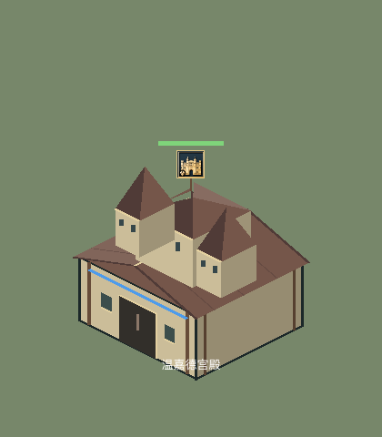
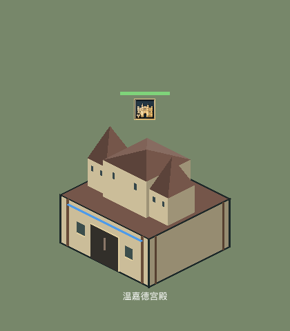

# 地标内部遮挡修复

2026-09-29；项目内 Godot 4.7.2、macOS arm64、OpenGL Compatibility 实际渲染。

## 对照图

全部 18 个地标和三种文明的奇观，使用相同的相机、缩放和背景：

| 修复前 | 修复后 |
| --- | --- |
| [全部建筑](before.png) | [全部建筑](after.png) |
|  |  |

修复前来自 `98c8992` 的建筑绘制脚本，在隔离目录加载，用同一预览脚本生成图片。所有图片均由游戏绘制代码直接输出。

## 修复

- 地标使用自身的完整楼翼、塔楼和屋顶，不再叠加通用宫殿／城堡的屋顶和中央塔楼；底部采用统一平台，上层结构有明确的承托面。
- 将地标面片保留为局部三维坐标，按面所在平面组织 BSP，必要时切分相交面，再从远到近绘制。能处理相交楼翼，避免整栋楼按中心排序时的局部遮挡错误。
- 补齐山墙和尖顶面；穹顶改为有实际高度的半球面片；窗户、钟面、柱子、垛口参与同一遮挡顺序。
- 奇观上层放在基座顶面，前侧塔楼能正常遮住后方主体。
- 图标／血条根据真实几何顶部定位；名称位于投影后的建筑底边下方。
- 点击检测使用实际绘制的地标面片，覆盖两侧塔楼、不同缩放和施工阶段。准备好的几何与顺序由建筑缓存，常规重绘不重新建立 BSP。

## 验证

- `landmark_rendering.gd`：真实 GPU 渲染 18 个地标和 3 个奇观，并保存各自截图与总览。
- `landmark_occlusion.gd`：逐点比较面片绘制顺序与独立的射线深度计算，包含全部 19 种几何及交叉楼翼的正、反提交顺序。1,832 个有效采样点全部一致。
- `landmark_selection.gd`：21 种外观 × 三档缩放（0.7 / 1.0 / 1.65）× 两个施工阶段（75% / 完工），14,106 个面中心可正常点击，并检查几何缓存复用。
- `landmark_catalog`、`landmark_roles`、`rally_landmarks`、`isometric_view`、`enemy_inspection`、`selection`、`smoke` 全部通过。

[测试输出](checks.log)

单次运行中，19 种几何的 BSP 准备总计约 56 ms；此数值仅用于记录一次性准备成本，不代表对局帧率。复杂奇观绘制仍比普通房屋有更多面片。

```sh
# 深度、点击和相关功能回归
python3 tools/check_navigation.py --tests landmark_occlusion landmark_selection \
  landmark_catalog landmark_roles rally_landmarks isometric_view enemy_inspection selection smoke

# 实际渲染截图：需要图形环境，不能加 --headless
# 可在 -- 后传入图片输出目录，默认 .godot/landmark-rendering
docs/godot/bin/godot.macos.template_debug.arm64 --path . \
  --script res://tests/landmark_rendering.gd --rendering-method gl_compatibility
```

面片排序使用游戏当前固定的 2:1 等距投影；若日后加入任意视角旋转，需要同步更新观察方向。场景中不同建筑、单位之间仍使用现有的实体深度排序，本次截图和深度校验覆盖建筑内部几何。

## 垛口四边补齐（同日后续修正）

前一版 `flat` / `clock` 地标仅生成了朝前的两侧垛口，原遮挡测试验证了已存在面片的顺序，未检查缺失的几何。现在补齐四边，齿块向屋顶内缩，角齿只生成一次。后侧齿块颜色加深 22%，侧面转角加深 8%，前侧保持亮色；普通城堡的顶塔及横／竖城墙、城门也统一沿四边绘制。

新增平顶、钟楼的四边完整性与齿块不重叠检查：修复前两项均失败，修复后通过。深度校验 1,858 个有效采样点一致；21,084 个点击采样点通过，等距视角回归通过。实渲染检查覆盖全部 21 种地标／奇观外观和 6 种普通防御建筑／朝向。

- [伯克郡宫殿：补齐后的垛口](battlements-after.png)
- [普通城堡、哨塔、横竖城墙和城门](battlements-fortifications.png)
- [测试输出](battlements-checks.log)

普通防御建筑预览可在渲染命令后追加 `-- 输出目录 --fortifications`。
