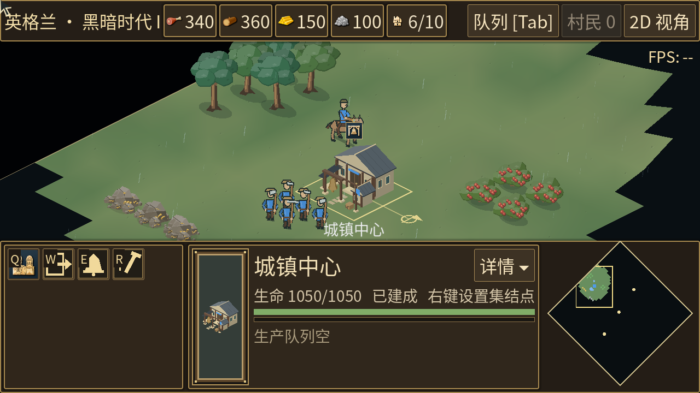

# 雨效调整

雨滴在屏幕坐标中向下飘落，2.5D 的地图旋转、纵向压缩和缩放不再改变雨丝方向、长度和速度。雨层在建筑与单位上方、HUD 下方；雨滴端点按地图边界与已探索区域过滤。雨天加入轻微整体冷色遮罩，天气切换用 1.4 秒淡入淡出。

保留雨天 10–16 秒、晴天 15–25 秒的周期。雨效仍是视觉表现，不影响单位速度、视野或战斗；没有添加音效或雨滴溅落。

## 实景对比

相同种子 `12345`、镜头位置、1280×720 画面、满强度雨天，暂停模拟后截图。

| 视角 | 修改前 | 修改后 |
| --- | --- | --- |
| 2D | [原图](before-2d.png) | [新图](after-2d.png) |
| 2.5D | [原图](before-25d.png) | [新图](after-25d.png) |



## 性能

- 单个绘制节点，不为每颗雨滴创建节点；两个批次绘制远近雨丝，加一次天气遮罩。
- 依据视口面积设置雨滴预算：720p 为 142、1080p 为 319，最大 320。旧版固定计算整张地图上的 520 颗雨滴。
- 重用线段缓冲；仅初始化或改变分辨率时计算起点、速度与长度。
- 比赛时钟仍以 30 Hz 更新天气周期，雨滴最多重绘 60 次/秒。镜头变化时立即重绘，避免雨层随地图漂移。120 Hz 稳定镜头下，180 次更新实测只有 90 次重绘。
- 淡出完成后隐藏绘制节点并停止其更新；暂停、结束比赛和返回菜单时冻结雨滴时钟。天气控制器继续维护晴天周期。

2026-10-01，Apple M2，项目本地 Godot 4.7.2 debug / OpenGL Compatibility。固定地图、冻结游戏模拟，每种条件预热 30 次、测量 180 次。下表是 **雨效绘制回调 CPU 耗时**，包含线段计算、迷雾过滤与绘制命令提交，不是整帧耗时，也不包含 GPU 时间。原始结果见 [benchmark.json](benchmark.json)。

| 分辨率 / 视角 | 旧版中位数 | 新版中位数 | 新版 P95 |
| --- | ---: | ---: | ---: |
| 1280×720 / 2D | 0.070 ms | 0.115 ms | 0.129 ms |
| 1280×720 / 2.5D | 0.069 ms | 0.118 ms | 0.131 ms |
| 1920×1080 / 2D | 0.069 ms | 0.241 ms | 0.294 ms |
| 1920×1080 / 2.5D | 0.069 ms | 0.239 ms | 0.269 ms |

新版增加了逐滴迷雾判断，并提高动画更新频率，因此 CPU 总开销高于旧版。优化控制了雨滴预算、重复计算和高刷新率重绘；该测量不代表整体游戏 FPS 提升。1080p 稳定镜头下，雨效约占每秒 14.5 ms 的单核 CPU 时间（中位数 × 60），晴天不绘制雨层。

## 验证和复现

`tests/weather.gd` 检查两种投影与三档缩放、淡入淡出、天气周期、暂停、重新开局、迷雾过滤、缓冲上限、晴天停绘，以及真实比赛树中天气控制器和绘制节点的独立更新。`smoke`、`fog_of_war`、`isometric_view`、`match_services`、`match_simulation_regression` 同时通过。

```sh
docs/godot/bin/godot.macos.template_debug.arm64 --headless --path . --script res://tests/weather.gd
docs/godot/bin/godot.macos.template_debug.arm64 --always-on-top --path . --script res://tools/weather_preview.gd
docs/godot/bin/godot.macos.template_debug.arm64 --always-on-top --path . --script res://tools/weather_benchmark.gd
```

预览工具默认写入本目录；性能工具默认写入忽略目录 `build/weather-benchmark.json`，可在命令末尾用 `-- res://输出路径.json` 指定文件。它们只改变当前运行窗口的显示设置，不保存用户偏好。

对比旧实现时，先提取改动前的脚本，移除全局类名以免与当前实现冲突，然后使用环境变量：

```sh
mkdir -p build/weather-baseline
git show 6beba595db26a9101fee0a7746c119c9c8bf8df7:scripts/world/weather.gd | sed '/^class_name RtsWeather$/d' > build/weather-baseline/weather.gd
RTS_WEATHER_BASELINE=res://build/weather-baseline/weather.gd docs/godot/bin/godot.macos.template_debug.arm64 --always-on-top --path . --script res://tools/weather_benchmark.gd
RTS_WEATHER_BASELINE=res://build/weather-baseline/weather.gd docs/godot/bin/godot.macos.template_debug.arm64 --always-on-top --path . --script res://tools/weather_preview.gd
```
